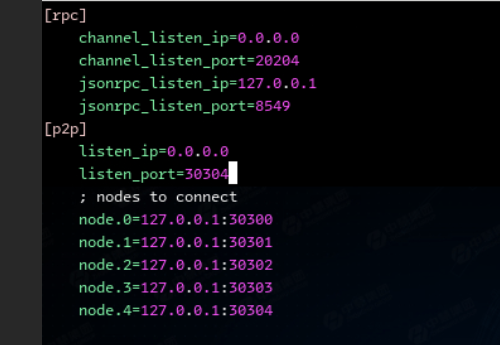

# 基于 Ubuntu 18.04 的 Docker 部署 FISCO BCOS

## 完成系统搭建配置与启动

### 查看 Docker 镜像（可能会用到）
- `docker images`

### 虚拟机内启动 Docker
- `sudo docker run -d --name fisco-bcos --network host --privileged fiscoorg/fisco-bcos:?`
---
### 使用/tools/给的工具创建 4 条节点
- `bash build_chain.sh -l 127.0.0.1:4 -b -e ~/tools/fisco-bcos`

### 启动节点
- `bash nodes/127.0.0.1/start_all.sh`

---

## 使用基于 Docker 命令查看区块链系统状态

- `docker ps`

---

## 检查区块链系统节点 `node0` 连接状态输出

- `tail -f nodes/127.0.0.1/node0/log/log* | grep connected`

---

## 配置控制台，管理相关证书并启动

1. **复制证书到控制台配置文件夹**：
   - `cp nodes/127.0.0.1/sdk/* ~/tools/console/conf`
   
2. **复制配置模板并重命名**：
   - `cp console/conf/config.toml.example console/conf/config.toml`
   
3. **启动控制台**：
   - `bash console/start.sh`

---

## 配置 MySQL 数据库，进行相关操作

### 进入 MySQL
- `mysql -u root -p`
- `ALTER USER ‘root’@‘localhost’ IDENTIFIED WITH mysql_native_password BY 'password';`

### 创建两个数据库
- `CREATE DATABASE webasenodemanager;`
- `CREATE DATABASE webasesign;`

### 授权
- `GRANT ALL PRIVILEGES ON webasenodemanager.* TO 'webasenodemanager'@'localhost';`
- `GRANT ALL PRIVILEGES ON webasesign.* TO 'webasesign'@'localhost';`

### 刷新权限
- `FLUSH PRIVILEGES;`
- `查看数据库： show databases`

---

## 使用命令启动管理平台服务，查询管理平台相关进程

1. **启动管理平台**：
   - `python3 deploy.py installAll`
   - 一路选 `no`
   
2. **修改配置文件**：
   - 修改 `webase-node-manager/conf/application.conf`：在 `url` 后面添加 `&useSSL=false`
   - 修改 `webase-sign/conf/application.conf`：在 `url` 后面添加 `&useSSL=false`

3. **查询进程**：
   - `python3 deploy.py check`

4. **使用浏览器访问管理平台**：
   - 输入 `localhost:5000`

---

## 使用工具生成新节点 `node4`

1. **生成新节点证书**：
   - `bash ~/tools/gen_node_cert.sh -c nodes/cert/agency -o nodes/127.0.0.1/node4`
   
2. **进入节点目录**：
   - `cd nodes/127.0.0.1/`
   
3. **复制配置文件到新节点**：
   - `cp node0/config.ini node0/start.sh node0/stop.sh node4/`
   - `cp node0/conf/group.1.* node4/conf/`
   
4. **编辑新节点配置文件**：
   - `vim node4/config.ini`

5. **启动新节点**：
   - `bash node4/start.sh`

6. **查看节点 ID**：
   - `cat node4/conf/node.nodeid`

7. **进入控制台**：
   - `bash console/start.sh`

8. **将 `node4` 加入节点**：
   - `addObserver node.nodeid`

---
# 测压

   

* 安装docker
 # 更新包索引
 - `sudo apt-get update`
   # 安装基础依赖库
 - `sudo apt-get install \`
   - `apt-transport-https \`
   `ca-certificates \`
   `curl \`
   `gnupg-agent \`
   `software-properties-common`
# 添加Docker官方GPG key
 - `curl -fsSL https://download.docker.com/linux/ubuntu/gpg | sudo apt-key add -`
# 添加docker仓库
 - `sudo add-apt-repository \`
   `"deb [arch=amd64] https://download.docker.com/linux/ubuntu \`
   `$(lsb_release -cs) \`
   `stable"`
# 更新包索引
 - `sudo apt-get update`
# 安装Docker
 - `sudo apt-get install docker-ce docker-ce-cli containerd.io`
